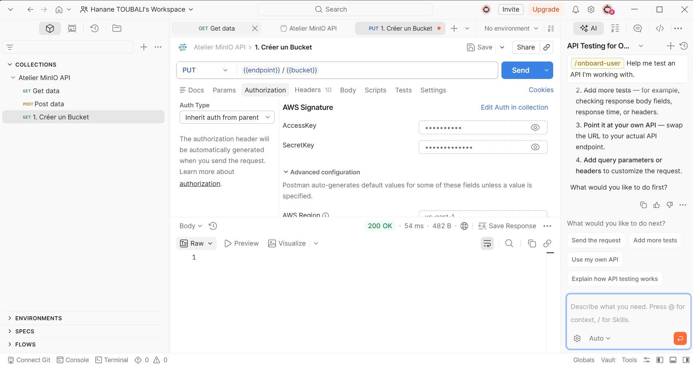
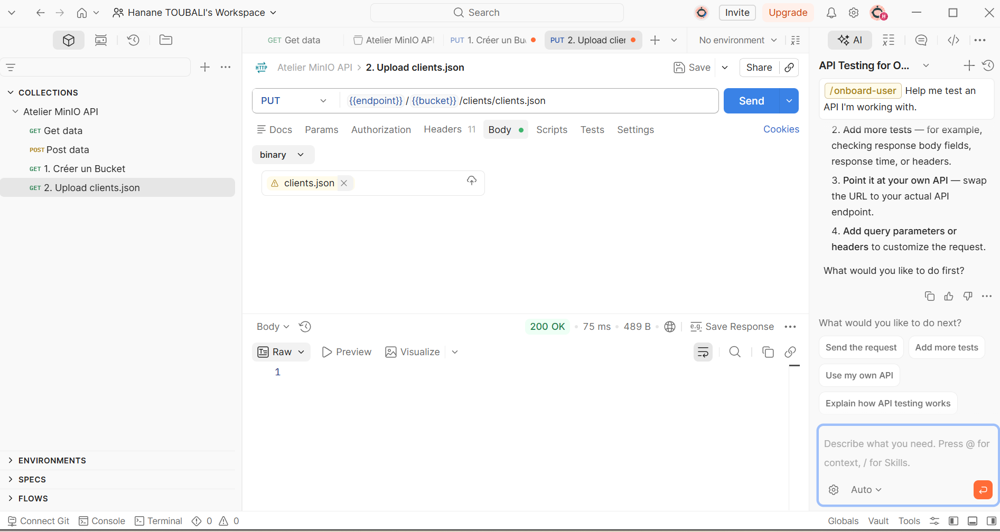
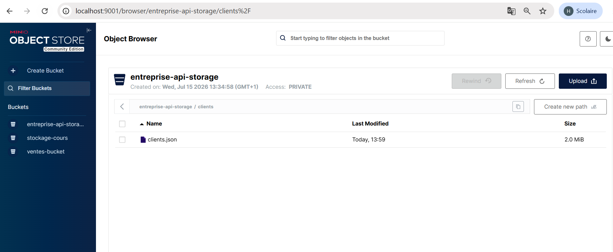
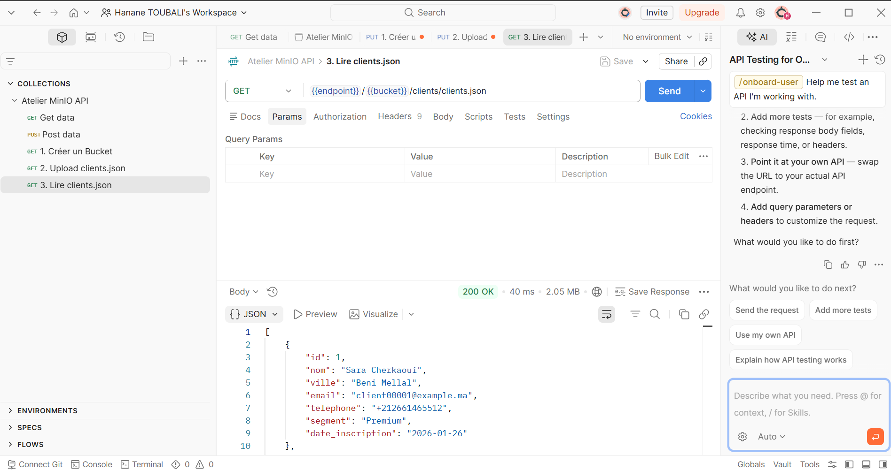
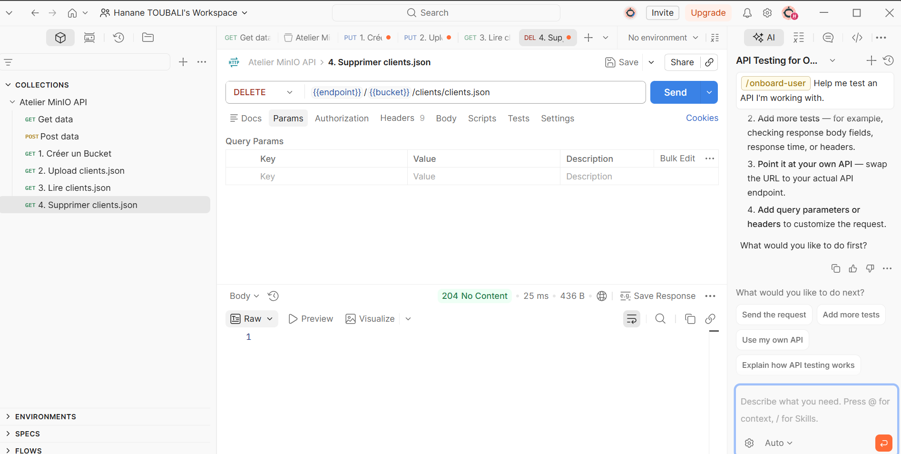
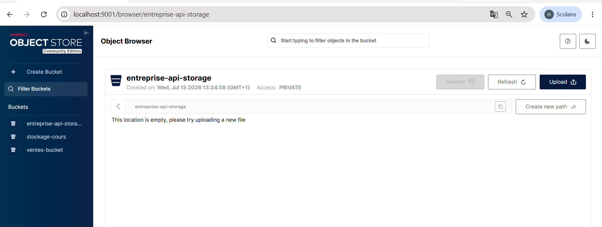

# TP MinIO Storage & Postman API

Ce projet présente la configuration d'un stockage objet local avec MinIO et la manipulation des objets via l'API S3 en utilisant Postman.

## 1. Création du Bucket (Interface MinIO & Postman)
* **Création du bucket via Postman:**
  

## 2. Upload de fichier `clients.json`
* **Upload via Postman (PUT):**
  
* **Vérification de l'existence du fichier dans MinIO:**
  

## 3. Lecture du fichier (GET)
* **Lecture du contenu de `clients.json` via Postman:**
  

## 4. Suppression du fichier (DELETE)
* **Suppression via Postman:**
  
* **Vérification du bucket vide dans MinIO:**
  
